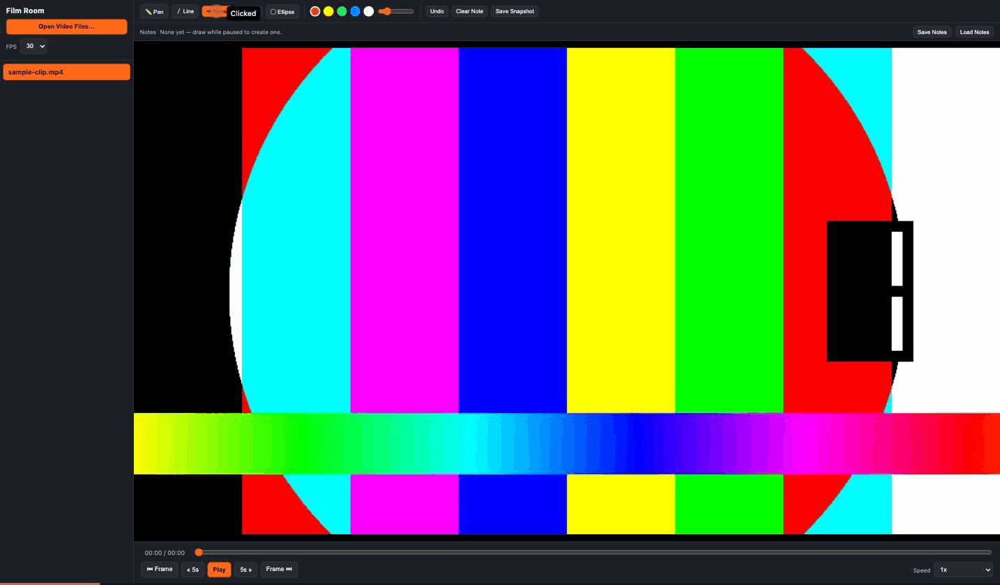

# Film Room

An offline coaching-film player: load video clips, review them like a Hudl-style
tool with slow motion, frame stepping, and rewind/fast-forward, and draw
**timestamped telestrations** — annotations tied to the exact moment you drew
them, which disappear as you move away and reappear when you scrub back.

Ships as both a zero-install **web app** — also installable as a PWA, and
works offline once installed — and an **Electron desktop app**, sharing the
same player engine. Also includes a companion stream downloader (browser
extension + remux script) for saving your own accessible game film locally,
and a parser for Hudl's "Save Page As" presentation exports.



*The demo above uses a synthetic color-bar test clip (see [Generating a test
clip](#generating-a-test-clip)) — draw an arrow while paused, skip forward and
it disappears, jump back to the note and it's there again.*

## Features

- **Playback controls** — play/pause, ±5s skip, previous/next frame, variable
  speed (0.1x–2x, for true slo-mo review), scrubbable seek bar.
- **Timestamped telestration** — pen, line, arrow, rectangle, and ellipse
  tools with color and stroke-width controls. Each note is tied to the video
  timestamp you drew it at: it's visible only while playback is at (or very
  near) that moment, and disappears the instant you move away — matching how
  coaches actually use freeze-frame diagrams.
  - A **Notes** strip shows every saved note as a clickable timestamp chip —
    click one to jump straight back to it.
  - **Undo** / **Clear Note** operate on whichever note is currently visible,
    leaving every other timestamp's notes untouched.
- **Saving telestrations**
  - Web app: auto-saved to the browser's local storage, keyed to that exact
    file (name + size + last-modified), so reopening the same file restores
    its notes automatically. Explicit **Save Notes** / **Load Notes** buttons
    export/import a `.json` file for backup or moving notes to another
    machine.
  - Electron app: auto-saved to a `<video-name>.telestration.json` sidecar
    file next to the video itself, loaded automatically whenever you reopen
    that video.
- **Snapshot export** — flattens the current frame + drawing into a PNG.
- **Installable, offline-capable web app** — a Web App Manifest + service
  worker cache the app shell, so `web/index.html` can be installed (desktop
  or mobile) and keeps working with no network at all. This is separate from
  loading video files, which always works offline regardless — it's about
  the app itself being available without a server to point a browser at.
- **Downloader** (`extension/` + `downloader/`) — a browser extension that
  watches the current tab for video the page is loading and downloads it
  through Chrome's own download manager (using your existing logged-in
  session — the extension never sees your password). It handles two delivery
  styles: HLS/DASH manifests (segments get downloaded then merged with a
  Node script that runs `ffmpeg -c copy`), and direct progressive video files
  (downloaded as a single already-playable file, no merge step) — which is
  what Hudl itself actually serves, based on the `.mp4` paths found in its
  own page-export data. A **Download All** button downloads every stream
  detected on the tab in one click, two at a time (a small bounded
  concurrency — enough to be meaningfully faster than one-at-a-time without
  hammering the server or fighting your own bandwidth the way full
  unbounded parallel downloads would). It also pulls play data (down,
  distance, formation, play call, result, quarter, …) from Hudl's own
  per-clip data fields into a `.meta.json` sidecar saved alongside the
  video — see [Clip naming](#clip-naming) for exactly what it reads.
- **Play Info panel** — select a clip's `.meta.json` sidecar alongside its
  video (web app) or just have it sitting next to the video file (Electron,
  auto-discovered) and the sidebar shows whatever the downloader captured
  for that play.
- **Hudl export importer** (`shared/hudl-import.js`) — parses a Chrome "Save
  Page As → Webpage, Complete" export of a Hudl presentation page (the
  `<name>.html` + `z/` folder format Hudl produces), resolving every
  camera-angle video file and any embedded coach telestration data. Verified
  against real exports; **not yet wired into the player UI** — see
  [Roadmap](#roadmap).

## How it works

The player is plain HTML5 `<video>` + a `<canvas>` overlay — no video
processing happens anywhere:

- Speed control uses `video.playbackRate`.
- Frame-stepping pauses and nudges `currentTime` by `1/fps`.
- Telestration strokes are recorded as vector points (normalized 0–1, so they
  stay aligned regardless of window size) grouped into "notes" keyed by the
  video timestamp (in ms) at the moment you started drawing. On every
  timestamp change, the canvas is cleared and redrawn with only the note
  whose timestamp is within ~120ms of the current playhead position.
- Starting a stroke automatically pauses the video, so the timestamp can't
  drift out from under you mid-drawing.

The downloader is a similarly thin layer: it doesn't touch video bytes
either. `chrome.webRequest` observes the tab's outgoing requests and
classifies any it recognizes as video — `.m3u8`/`.mpd` manifests, a
`.mp4`/`.m4v`/`.mov`/`.webm` file, or (for an opaque, extension-less CDN URL)
anything Chrome itself tags as a `<video>`/`<audio>` element's own network
fetch. `chrome.downloads` then transfers the actual file(s) through the
browser's own network stack, so your session cookies apply automatically.
Manifest-based streams get their segments merged afterward with
`ffmpeg -c copy` (no re-encoding); a direct progressive file needs no merge
step at all. **Download All** runs up to 2 of these jobs at once (a small
`async` worker pool in the popup) rather than either fully sequential (slow
with several streams) or fully unbounded parallel (competes with itself for
your bandwidth and can look like a burst of abusive traffic to the site's
server) — 2 is a deliberately modest middle ground, not a tuned number.

Right before a download starts, a separate small script runs in the page
itself (`chrome.scripting.executeScript`, not `chrome.webRequest`, since this
one needs to read the DOM) to pull identifying info and play data for the
`.meta.json` sidecar and the clip's filename — see [Clip
naming](#clip-naming) for exactly what it reads and how.

## Project layout

```
shared/          Player engine + Hudl-export parser, used by both apps
  player.js        Playback + timestamped-telestration engine
  player.css        Shared UI styling
  play-info.js       Renders a clip's .meta.json sidecar as a Play Info panel
  hudl-import.js     Parses a Hudl "Save Page As" export into a play library

web/             Zero-install web app (open web/index.html)
  manifest.webmanifest  PWA manifest (name, icons, start_url, ...)
  icons/                 App icons for the manifest / favicon / apple-touch
sw.js            PWA service worker (repo root, not web/ -- see its own
                   comment for why its scope needs to cover shared/ too)
electron/        Installable desktop app (Electron)

extension/       Browser extension: detects & downloads video (HLS/DASH
                   segments or a direct progressive file), and scrapes
                   page metadata for clip naming + the Play Info sidecar
downloader/      remux.js — merges downloaded HLS/DASH segments into one MP4
                   (not needed for a direct progressive-file download)

docs/            README assets (demo GIF)
```

## Setup

### Prerequisites

- [Node.js](https://nodejs.org/) 18+ and npm (for the Electron app and the
  remux script)
- [ffmpeg](https://ffmpeg.org/) on your `PATH` (for the remux script, and to
  generate a synthetic test clip if you don't have real footage handy)
  - macOS: `brew install ffmpeg`
- A Chromium-based browser (Chrome, Edge, Brave, …) if you want to use the
  downloader extension

### 1. Web app (no install)

```bash
# from the repo root
python3 -m http.server 8934
```

Then open `http://localhost:8934/web/index.html`. (You can also just
double-click `web/index.html` — it works over `file://` too, since nothing in
it depends on a server — but a local server avoids any browser quirks around
local-file permissions, and is required for the PWA install/offline support
below, which needs a real origin.)

Click **Open Video Files…** and pick any local `.mp4`/`.mov`/`.webm` files. If
the downloader extension saved a `<clip>.meta.json` alongside a video (see
[Clip naming](#clip-naming)), select it together with its video and the
sidebar will show a **Play Info** panel for that clip.

**Installing as an app / offline use:** once served over `http://` (not
`file://`), the page is installable — most browsers show an install icon in
the address bar, or use the browser's menu ("Install Film Room…" /
"Add to Home Screen"). A service worker caches the app itself (not your video
files, which are always local and never touch the network) so it keeps
working with no connection at all once installed.

**If you're editing the code:** Python's `http.server` doesn't send
`Cache-Control` headers, so Chrome can silently keep serving a stale cached
copy of `player.css`/`player.js` after you edit them — a hard reload
(Cmd/Ctrl+Shift+R) or DevTools' "Disable cache" (Network tab, while DevTools
is open) forces it to refetch. If you've already installed the PWA, its
service worker adds a second layer of caching on top of that — bump
`CACHE_NAME` in `sw.js` after changing anything under `web/` or `shared/` so
installed copies pick up the update, and unregister the old service worker
(DevTools → Application → Service Workers) if you still see stale content
while developing.

### 2. Electron desktop app

```bash
cd electron
npm install
npm start
```

**macOS Gatekeeper note:** the first time you `npm install`, macOS may refuse
to launch the freshly-downloaded `Electron.app` with a *"contains malware"*
warning. This is a well-known false positive on npm-distributed Electron
binaries, not an actual detection — the fix is:

```bash
xattr -cr electron/node_modules/electron/dist/Electron.app
```

If macOS has already deleted the binary (it sometimes does, not just
quarantines it), delete `electron/node_modules/electron` and re-run
`npm install` inside `electron/`, then apply the `xattr` command again before
`npm start`.

### 3. Downloader extension

1. Open `chrome://extensions`, enable **Developer mode**.
2. Click **Load unpacked** and select the `extension/` folder.
3. Visit the video page you're logged into (in a tab you're legitimately
   authorized to view), start playback so the video's manifest loads, then
   click the extension icon.
4. Click **Download** next to a detected stream, or **Download All** to grab
   every stream detected on the tab in one click (two at a time — see
   [How it works](#how-it-works)). Segments save under
   `Downloads/FilmRoomDownloads/<name>/`, where `<name>` is built from
   whatever identifying info it can find on the page (see
   [Clip naming](#clip-naming) below) — the popup shows exactly what it
   picked ("Naming as: …") before each download starts. If the page had a
   table or label/value data worth keeping (down & distance, formation,
   etc.), a `<name>.meta.json` sidecar is saved alongside the video too —
   select it together with the video in the Film Room player to see it as a
   **Play Info** panel.
5. Run the remux script on that folder:

```bash
node downloader/remux.js "~/Downloads/FilmRoomDownloads/<title>"
```

This produces `output.mp4` in that same folder — open it in the Film Room
player.

### Clip naming

The extension runs a small script in the page itself (via
`chrome.scripting.executeScript`) right before each download to build a
clip name and, where available, a `.meta.json` sidecar of play data:

1. **Hudl's own per-clip data fields.** Hudl's video-review page renders a
   toolbar above the video with each field (`PLAY #`, `DN`, `DIST`,
   `YARD LN`, `OFF FORM`, `OFF PLAY`, `RESULT`, `QTR`, …) tagged with its own
   `data-qa-id="clip-preview-<FIELD NAME>-field"` attribute — Hudl's own
   stable test-hook markup for exactly this data, confirmed against a real
   page (not a guess). Every populated field becomes an entry in the
   `.meta.json` sidecar's `fields`, and the `PLAY #` field becomes the clip
   name's play number directly — no guessing needed on Hudl itself.
2. If that toolbar isn't present (a non-Hudl page, or a layout change),
   falls back to a generic, blind heuristic: a visible **"Play N"**-style
   label on whatever looks like the current list item, then anywhere in the
   page's text, then inside an inline `<script>` JSON blob; and separately,
   any `<table>` or `<dl>` on the page becomes `fields`/`tables` in the
   sidecar. This tier works or it doesn't depending on how a given page
   happens to render — if you hit it and it comes up empty, tell me what
   the page's play-detail markup actually looks like (right-click →
   Inspect) and I can add a targeted rule the way Hudl's got one.
3. Falls back further to the page's `<title>` if no play number was found
   at all.
4. The clip's **video ID**, read from the page URL's `?v=` query parameter
   (e.g. `.../analyze?v=97953713&...`), is always appended regardless of the
   above — reliable since it's Hudl's own URL scheme, not a guess — so
   clips never collide even without a play number.

### Generating a test clip

If you don't have real footage handy, this makes a 10-second synthetic
color-bar clip (the one used for the demo GIF above) that decodes anywhere:

```bash
ffmpeg -f lavfi -i "testsrc=duration=10:size=960x540:rate=30" \
       -f lavfi -i "sine=frequency=440:duration=10" \
       -pix_fmt yuv420p -c:v libx264 -c:a aac -shortest \
       sample-clip.mp4
```

## Roadmap

- Wire `shared/hudl-import.js` into the player UI (an "Import Hudl Export…"
  button, a play list with per-play camera-angle switching, and replaying
  Hudl's own embedded coach telestrations alongside your own notes).
- DASH/fragmented-MP4 (`.m4s`) segment support in the downloader — currently
  targets the more common `.ts`-segment HLS case.
- The generic fallback play-number/table/`<dl>` scraping (tier 2 in [Clip
  naming](#clip-naming), for non-Hudl pages) is only verified against
  synthetic DOM structures — Hudl itself now uses the targeted
  `clip-preview-*-field` extraction instead, confirmed against real markup.
- **Download All**'s concurrency of 2 is a starting guess, not something
  tuned against how Hudl's server actually responds under load.
- The ag-Grid play-by-play table visible in Hudl's sidebar (all 8 clips at
  once, same fields as columns) isn't scraped — only the current clip's
  toolbar is. Would need mapping ag-Grid's `col-id` attributes to their
  header text, which the toolbar fields make unnecessary for the common
  case (metadata for the clip you're actually downloading).

## Responsible use

The downloader extension only automates what your browser already does when
you're logged in — it doesn't handle or store credentials, and it doesn't
touch anything you aren't already authorized to view in that tab. That said,
scraping/downloading video is very likely against most platforms' Terms of
Service even when you have legitimate viewing access to the content (e.g.
your own team's film) — check the ToS of whatever site you point this at, and
use it for personal, offline review of content you have the rights to, not
redistribution.

## License

MIT — see [LICENSE](LICENSE). Applies to the code in this repository only,
not to any video content you use it with.
